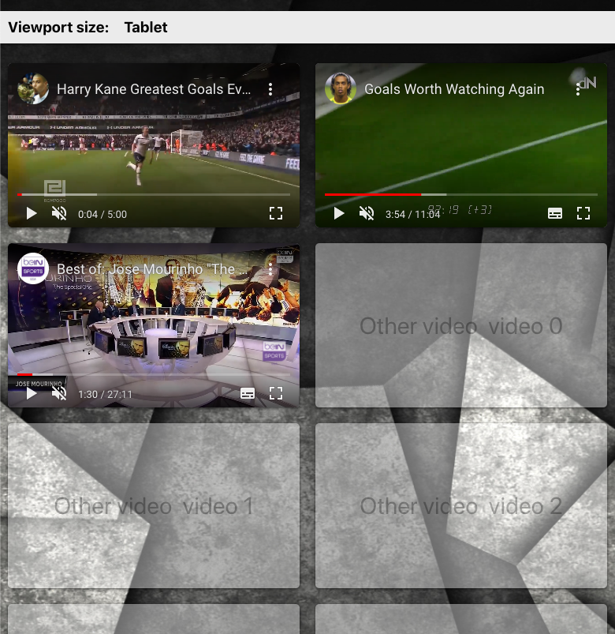
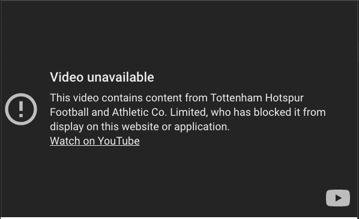

# Simple test

  

This project was bootstrapped with [Create React App](https://github.com/facebook/create-react-app).

## Please note:

- The suggested video can't be used because the display has been blocked by the owner:

  

- On mobile and tablet the video list implements a vertical scroll, on desktop the scroll is horizontal. In both cases the list implements a CSS scroll snapping.

- Basic tests have been implemented

## Available Scripts

In the project directory, you can run:

### `yarn start`

Runs the app in the development mode.\
Open [http://localhost:3000](http://localhost:3000) to view it in the browser.

The page will reload if you make edits.\
You will also see any lint errors in the console.

### `yarn test`

Launches the test runner in the interactive watch mode.\
See the section about [running tests](https://facebook.github.io/create-react-app/docs/running-tests) for more information.

### `yarn build`

Builds the app for production to the `build` folder.\
It correctly bundles React in production mode and optimizes the build for the best performance.

The build is minified and the filenames include the hashes.\
Your app is ready to be deployed!
